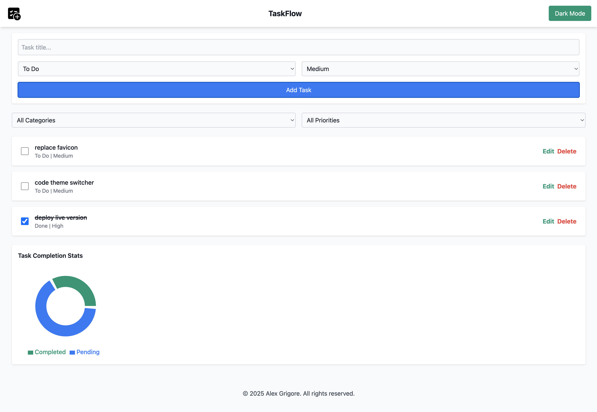
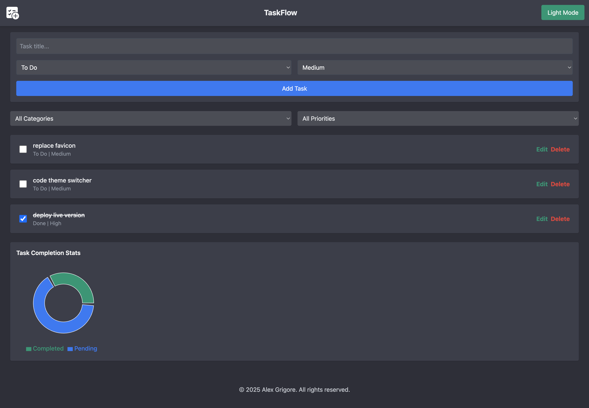

# TaskFlow - Smart Task Management

TaskFlow is a modern, responsive task management web app that lets you add, edit, delete, filter, and visualize tasks. It supports light & dark modes, drag-and-drop reordering, and interactive charts for tracking progress.

---

## Features

-   Add, edit, and delete tasks inline
-   Mark tasks as complete
-   Filter tasks by category and priority
-   Drag-and-drop task reordering
-   Interactive charts for task statistics
-   Light & Dark mode toggle
-   Persistent storage with LocalStorage
-   Responsive design for desktop and mobile
-   Open Graph & Twitter Cards for sharing

---

## Demo

Live link: [https://taskflow-woad-omega.vercel.app](https://taskflow-woad-omega.vercel.app)

---

## Screenshots




---

## Tech Stack

-   React 19 (hooks & functional components)
-   Tailwind CSS
-   @hello-pangea/dnd (drag-and-drop)
-   Recharts (charts & stats)
-   React Helmet (meta tags & SEO)
-   Vercel (deployment)

## 📦 Installation

```bash
# Clone the repo
git clone https://github.com/<your-username>/taskflow.git
cd taskflow
```

```bash
# Install dependencies
npm install
```

```bash
# Start development server
npm start
```

## Author

Alex Grigore
BSc Computer Science Student | Front-End Developer

-   agworksbox@gmail.com
-   https://alex-grigore.netlify.app

## MIT License

Copyright (c) 2025 Alex Grigore

Permission is hereby granted, free of charge, to any person obtaining a copy
of this software and associated documentation files (the "Software"), to deal
in the Software without restriction, including without limitation the rights
to use, copy, modify, merge, publish, distribute, sublicense, and/or sell
copies of the Software, and to permit persons to whom the Software is
furnished to do so, subject to the following conditions:

The above copyright notice and this permission notice shall be included in all
copies or substantial portions of the Software.

THE SOFTWARE IS PROVIDED "AS IS", WITHOUT WARRANTY OF ANY KIND, EXPRESS OR
IMPLIED, INCLUDING BUT NOT LIMITED TO THE WARRANTIES OF MERCHANTABILITY,
FITNESS FOR A PARTICULAR PURPOSE AND NONINFRINGMENT. IN NO EVENT SHALL THE
AUTHORS OR COPYRIGHT HOLDERS BE LIABLE FOR ANY CLAIM, DAMAGES OR OTHER
LIABILITY, WHETHER IN AN ACTION OF CONTRACT, TORT OR OTHERWISE, ARISING FROM,
OUT OF OR IN CONNECTION WITH THE SOFTWARE OR THE USE OR OTHER DEALINGS IN THE
SOFTWARE.
